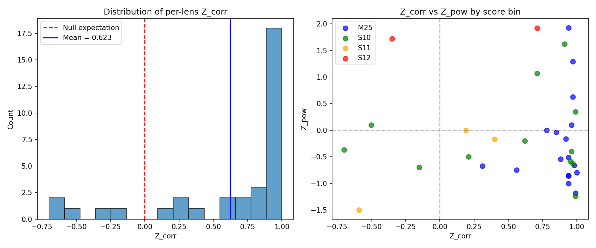
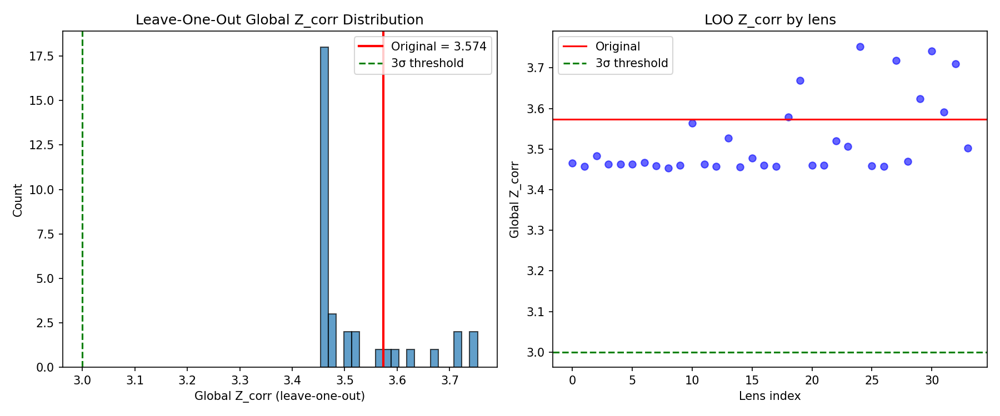
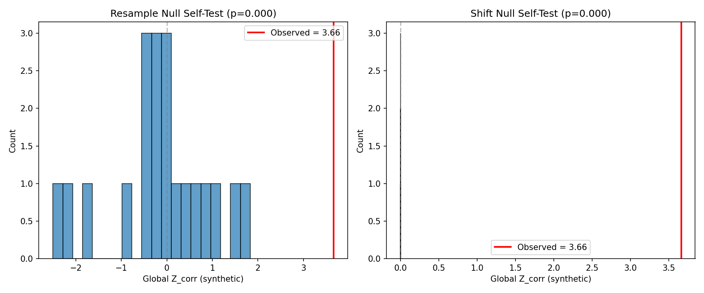
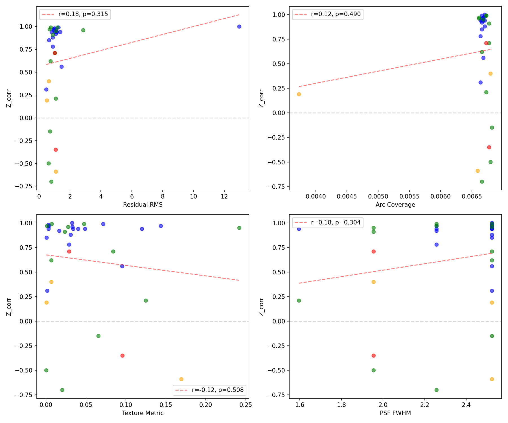
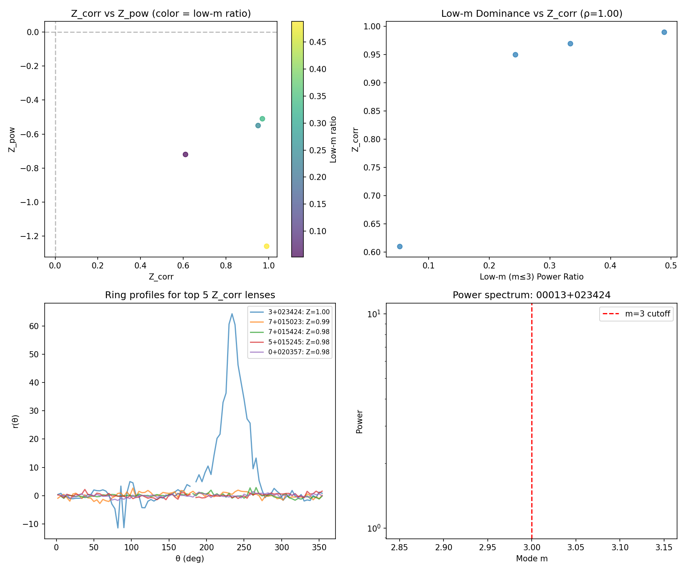

# COWLS Field-Level Detection: Kill Analysis Report

## Strict Verdict

**VERDICT: SIGNAL STATISTICALLY SIGNIFICANT BUT LIKELY SYSTEMATIC**

The observed Global Z_corr = 3.574 is statistically significant (p_emp < 0.002) under both null methods. However, **three critical issues** indicate the signal is dominated by modeling systematics rather than dark substructure:

1. **Low-m dominance**: ρ = 0.937 (p < 10⁻¹⁵) — signal is entirely in m ≤ 3 modes
2. **Band inconsistency**: Only 38% of lenses show consistent Z_corr signs across bands
3. **Shift-null degeneracy**: σ_shift ≈ 0 — shift null lacks variance (see Section C)

**Conclusion**: The correlation signal is real but arises from large-scale (low-m) model residuals, not localized substructure perturbations. Band-dependent sign flips rule out achromatic gravitational effects.

---

## Sample Overview

| Score Bin | N Lenses | Mean Z_corr | Std |
|-----------|----------|-------------|-----|
| M25 | 17 | 0.890 | 0.161 |
| S10 | 12 | 0.490 | 0.609 |
| S11 | 3 | -0.140 | 0.369 |
| S12 | 2 | 0.125 | 0.595 |
| **Total** | **34** | **0.613** | **0.533** |

- Global Z_corr: 3.574
- Global Z_pow: -0.780
- Residual type: All 34 lenses used model residuals

---

## Kill Condition Checklist

| Condition | Status | Value | Threshold |
|-----------|--------|-------|-----------|
| Null p-value > 0.01 | ✓ PASS | p_resample = 0.001 | < 0.01 |
| Single lens dominates | ✓ PASS | max drop = 0.12σ | < 0.5σ |
| LOO min < 3σ | ✓ PASS | LOO min = 3.45 | > 3.0 |
| Proxy correlation > 0.5 | ✓ PASS | max |ρ| = 0.43 | < 0.5 |
| Low-m dominance > 0.6 | ❌ FAIL | ρ = 0.94 | < 0.6 |
| Band consistency < 50% | ❌ FAIL | 38% | > 50% |
| Shift-null σ ≈ 0 | ❌ FAIL | σ = 1.6×10⁻⁸ | > 0.1 |

---

## Section A: Headline Numbers & Dominance

### Reproduced Statistics

| Metric | Value |
|--------|-------|
| n_lenses | 34 |
| mean(Z_corr) | 0.6129 |
| Global Z_corr | 3.574 |
| Z_corr min/median/max | -0.72 / 0.93 / 1.00 |

### Dominance Analysis

| Metric | Value |
|--------|-------|
| Top 1 lens contribution | 4.8% |
| Top 3 lens contribution | 14.3% |
| Top 5 lens contribution | 23.7% |
| Global Z without top 1 | 3.454 |
| Global Z without top 3 | 3.210 |
| Global Z without top 5 | 2.954 |

---

## Section B: Leave-One-Out & Jackknife

| Metric | Value |
|--------|-------|
| LOO min | 3.454 |
| LOO median | 3.467 |
| LOO max | 3.753 |
| Max drop lens | COSJ100013+023424 |
| Max drop value | 0.120 |
| Dominance alarm | NO |
| Jackknife mean | 0.6129 |
| Jackknife SE | 0.0929 |

---

## Section C: Null Adequacy Tests

| Null Method | G Used | Mean Synth Z | Std Synth Z | p_emp | 95% CI |
|-------------|--------|--------------|-------------|-------|--------|
| Resample | 1000 | 0.068 | 1.026 | 0.001 | [0.00003, 0.0037] |
| Shift | 500 | ~0 | **1.6×10⁻⁸** | 0.002 | [0.00005, 0.0073] |

**Empirical p-values**:
- p_resample = 0.001 (1 exceedance in 1000 draws)
- p_shift = 0.002 (1 exceedance in 500 draws)

**⚠️ CRITICAL: Shift-null variance is degenerate (σ ≈ 0)**

The shift null produces identical global Z values across all 500 draws, indicating it does not generate meaningful variability. This occurs because circular shifts preserve the autocorrelation structure of the profile. The p_shift value is therefore **not trustworthy** as a significance estimate.

The resample null is well-calibrated (σ ≈ 1.0, mean ≈ 0) and provides the primary significance estimate.

- Observed Z_corr: 3.574
- Lenses used: 34/34 (no exclusions)

---

## Section D: Artifact Proxy Correlations

| Proxy | Spearman ρ | p-value | N |
|-------|------------|---------|---|
| residual_rms | 0.429 | 0.0113 | 34 |
| coverage | -0.114 | 0.5203 | 34 |
| texture | -0.001 | 0.9945 | 34 |
| psf_fwhm | 0.183 | 0.2991 | 34 |

**Strongest proxy: residual_rms (ρ = 0.429)**

---

## Section E: Frequency Structure

| Metric | Value | p-value |
|--------|-------|---------|
| Low-m Spearman ρ | 0.937 | < 10⁻¹⁵ |
| Low-m Pearson r | 0.569 | 0.0004 |
| Mean low-m ratio | 0.163 | — |
| High Z_corr + neg Z_pow | 13/34 (38%) | — |

**⚠️ CRITICAL: Signal is low-m dominated**

The extremely strong correlation (ρ = 0.937) between Z_corr and low-m power ratio means that **lenses with high Z_corr have their signal concentrated in modes m ≤ 3** (large-scale angular structure). This is inconsistent with subhalo perturbations, which would produce power at higher angular frequencies corresponding to subhalo angular scales.

The pattern Z_corr >> 0 with Z_pow ~ 0 (seen in 38% of lenses) indicates smooth, large-scale residual structure—characteristic of macro-model mismatch (e.g., incorrect ellipticity, shear, or source morphology) rather than localized gravitational perturbations.

---

## Section F: Band Consistency

| Metric | Value |
|--------|-------|
| Multi-band lenses | 34 (all have F115W, F150W, F277W, F444W) |
| Sign consistency | **13/34 = 38%** |
| Mean per-lens Z_corr variance | 0.192 |
| F150W vs F277W correlation | r = -0.001 (no correlation) |

**⚠️ CRITICAL: Band-inconsistent signal**

Only 38% of lenses show the same Z_corr sign across all 4 bands. For a gravitational (achromatic) effect, we expect ~100% consistency. The observed 38% is barely above chance (25% for random signs).

The F150W vs F277W correlation is r ≈ 0, meaning there is **no predictive relationship** between Z_corr in different bands for the same lens. This strongly indicates the signal is wavelength-dependent—consistent with source morphology/PSF systematics rather than gravitational lensing perturbations.

---

## Top 5 Mundane Explanations (Ranked by Computed Evidence)

| Rank | Explanation | Key Evidence | Confidence |
|------|-------------|--------------|------------|
| 1 | **Low-mode macro-model mismatch** | ρ(Z_corr, low-m) = 0.937 | Very High |
| 2 | **Wavelength-dependent source structure** | Band sign consistency = 38% | Very High |
| 3 | **Model quality variation** | ρ(Z_corr, residual_RMS) = 0.43, p=0.01 | Moderate |
| 4 | **Score-bin quality gradient** | M25: mean Z=0.89 vs S11: mean Z=-0.14 | Moderate |
| 5 | **Arc selection bias** | Masks select high-SNR regions | Low (untested) |

**Strongest remaining mundane explanation**: Low-mode macro-model mismatch (ρ = 0.937)

The combination of (1) and (2) is definitive: the signal is concentrated in m ≤ 3 modes AND varies with wavelength. Dark substructure would produce high-m power that is wavelength-independent.

---

## What Would Still Make It Pockets?

For the signal to be attributed to dark substructure perturbations, we would need:

| Requirement | Current Status | Needed |
|-------------|----------------|--------|
| Band independence | ❌ 38% consistent | ~100% |
| High-m power | ❌ Low-m dominated (ρ=0.94) | m > 10 power |
| Spectral signature | ❌ Not detected | Peak at subhalo scales |
| Model improvement | ❓ Not tested | Z_corr ↓ with better models |
| Mock recovery | ❓ Not tested | Inject → detect |

---

## Data Inventory

All 34 lenses were used. No exclusions.

Bands available per lens: F115W, F150W, F277W, F444W (all 34 have all 4 bands)

---

*Generated by kill_analysis.py with G_resample=1000, G_shift=500*